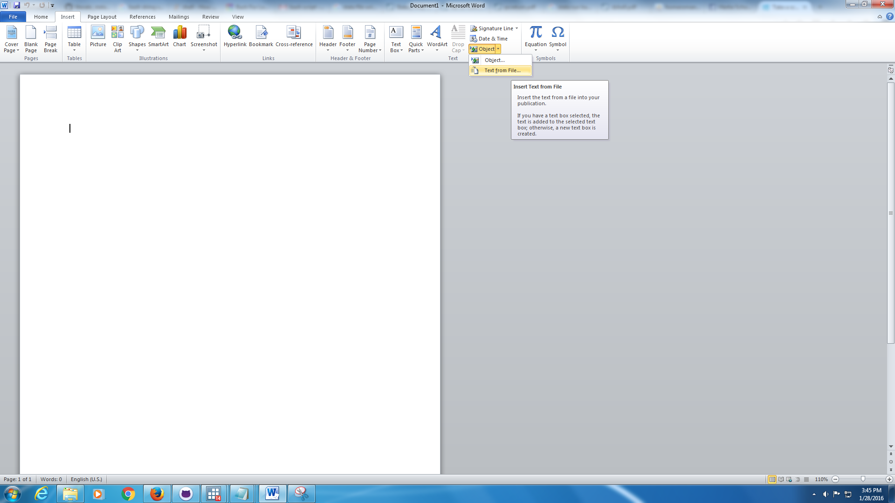
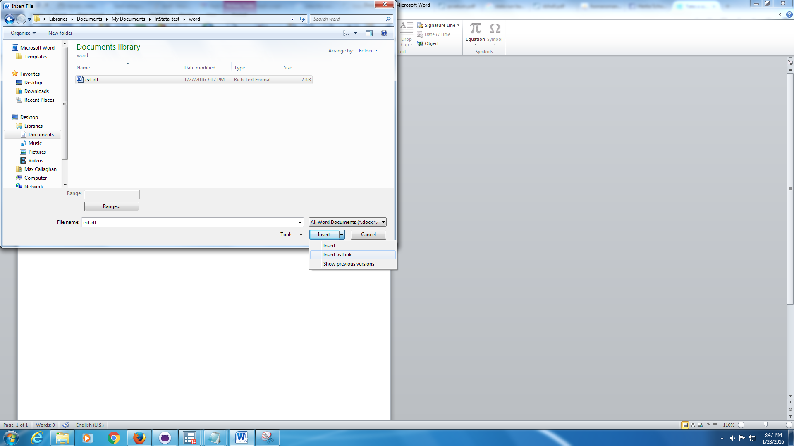

#Literate Stata

Literate Stata allows you to save sections of Stata output in a format that can easily be 
inserted as linked text into a word processor document.

## Install the package

```
net from https://raw.githubusercontent.com/mcallaghan/literate_stata/master
```

## Save logs (demarcated with *@s and *@e)

```
cap log close
log using ex1, text replace
*@s
sysuse auto.dta
dis 5+6
reg mpg weight
*@e
cap log close

```

## Run the command to format as rtf

```
logs2rtf , 
```

## Insert text from file as a link into your word processor






In your do file, save each portion of output you want to be included in your wp doc as a separate text log. 
Designate the start and the end of the output you want to include with the markers \*@s and \*@e.

The program in this ado file (which you can store on your computer following [these](https://stata.com/manuals13/u17.pdf) (pdf)
instructions) extracts the bit of the log you want (cleaning up some record-keeping stuff that is automatically included) and saves
it as an rtf file with some formatting options which you can customise (values between 0 and 255 for red, green and blue as well as
font size).

In a word document you can "Insert text from file" then click the insert drop-down arrow then "Insert as link". 
This way, every time you run your analysis again, you can go into your word document, select all, and then press F9 to
update all the Stata output. 

Any changes you made in your analysis will be reflected in your write-up automatically!

Here's an example:


And here's the syntax:
```
syntax  ,src(string) dest(string) [ red(integer 0) green(integer 0) blue(integer 0) fs(integer 8) ]
```

src and string are mandatory options to tell stata where to look for your log files and where to save the rtf files,
the other options are for formatting.
